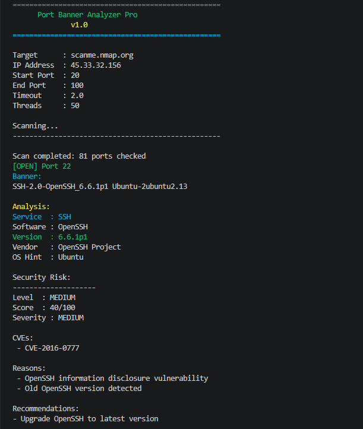
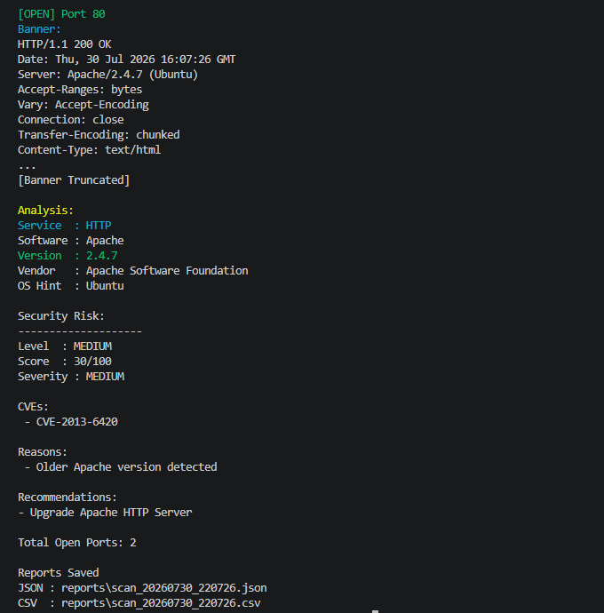

# 🔍 Port Banner Analyzer Pro


A professional Python-based cybersecurity reconnaissance tool for TCP port scanning, banner grabbing, service fingerprinting, risk assessment, vulnerability detection, and security reporting.

---

# 📌 Overview

Port Banner Analyzer Pro is an advanced network reconnaissance and security analysis tool developed using Python.

The tool scans TCP ports, collects service banners, identifies running services, detects software versions, analyzes security risks, detects known vulnerabilities, and generates detailed security reports.

This project demonstrates practical implementation of Python for Cyber Security concepts including:

- Network Programming
- TCP Socket Communication
- Multi-threading
- Banner Grabbing
- Service Fingerprinting
- Vulnerability Detection
- Risk Assessment Automation


---

# 🎬 Demo


<p align="center">
  
</p>


# 🚀 Features

## 🔹 Network Scanning

Perform fast and efficient TCP port scanning with concurrent execution for improved performance.

✅ TCP Port Scanner  
✅ Multi-threaded scanning using ThreadPoolExecutor  
✅ Fast concurrent port scanning  
✅ Custom port range support  
✅ Timeout control  
✅ Live scan progress counter  


## 🔹 Banner Grabbing & Analysis

Collect and analyze service banners to identify running services and extract useful information.

✅ TCP Banner Collection  
✅ Smart HTTP Request Handling  
✅ SSH Banner Handling  
✅ Banner Cleaning & Truncation  
✅ Automatic service detection  


## 🔹 Service Fingerprinting

Identify software, versions, vendors, and operating system hints using banner fingerprinting.

✅ Regex-based service detection  
✅ Software identification  
✅ Version extraction  
✅ Vendor detection  
✅ Operating system hint detection  


## 🔹 Security Risk Analysis

Analyze detected services for known risks, vulnerabilities, CVEs, and calculate security severity.

✅ Service Risk Detection  
✅ CVE Detection  
✅ Security Risk Reporting  
✅ Risk Score Engine  
✅ Severity Calculation  
✅ Security Recommendation System  


Risk Levels:

- LOW
- MEDIUM
- HIGH
- CRITICAL


## 🔹 Reporting System

Generate structured reports for documentation and further security analysis.

✅ JSON Report Export  
✅ CSV Report Export  
✅ Timestamped Reports  
✅ Risk Score Export  
✅ Severity Report Export  


## 🔹 Professional CLI

Provide a clean and user-friendly command-line interface with robust error handling.

✅ argparse based command interface  
✅ Version system  
✅ Colored terminal output using Colorama  
✅ Invalid hostname handling  
✅ Error handling  
✅ KeyboardInterrupt handling  
✅ Global exception handling  


## 🔹 Logging System

Maintain detailed logs for debugging, troubleshooting, and scan history.

✅ Professional logging system  
✅ Scan activity logging  
✅ Error tracking  
✅ Debug information storage  


---

# 🏗️ Project Architecture

```text
PortBannerAnalyzerPro/

│
├── banner_analyzer.py
│       Main CLI Application
│
├── core/
│
│   ├── scanner.py
│   │       TCP Port Scanner Engine
│   │
│   ├── banner.py
│   │       Banner Grabbing Module
│   │
│   ├── analyzer.py
│   │       Service Fingerprinting Engine
│   │
│   ├── risk.py
│   │       Risk Score & Security Analysis Engine
│   │
│   ├── colors.py
│   │       CLI Color Management
│   │
│   └── logger.py
│           Logging System
│
├── reports/
│       JSON & CSV Reports
│
├── logs/
│       Application Logs
│
├── test_server.py
│       Local Testing Server
│
└── requirements.txt
```

# 📸 Screenshots


### 🔍 Risk Analysis




### 📊 Report Export



# 🚀 Future Improvements

- 🔹 Integration with Nmap engine for advanced scanning
- 🔹 Real-time CVE database API integration
- 🔹 Web-based dashboard for scan visualization
- 🔹 PDF security report generation
- 🔹 Advanced OS fingerprinting
- 🔹 Database support for scan history
- 🔹 User authentication and role-based access
- 🔹 Docker container support
- 🔹 Automated vulnerability report generation


🛠 Technologies Used
⚡ Installation
▶ Usage